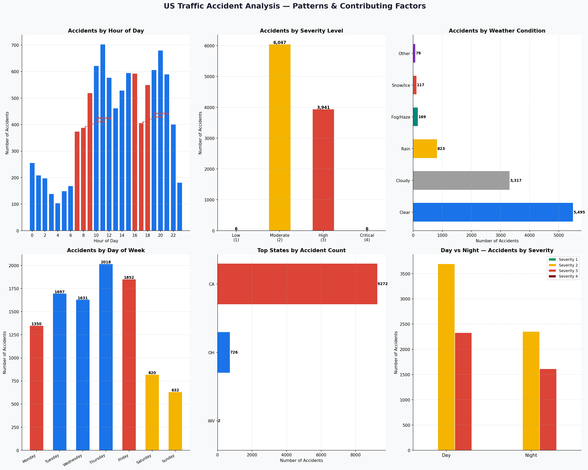

# PRODIGY_DS_05 — US Traffic Accident Pattern Analysis

## Task Overview
Analyze traffic accident data to identify patterns related to road 
conditions, weather, and time of day. Visualize accident hotspots 
and contributing factors.

**Internship:** Prodigy InfoTech — Data Science Track

## Dataset
- **Source:** Kaggle — US Accidents (Sobhan Moosavi)
- **Full dataset:** 7.7 million accidents (2016–2023), ~3GB
- **Sample used:** 10,000 rows (included in this repo)
- **Features:** 46 columns including location, weather, severity, time

## Dataset Availability
The full dataset is too large to upload to GitHub.
A 10,000 row sample (`sample_US_Accidents.csv`) is included for 
demonstration. To run on the full dataset, download from Kaggle and 
update the file path in the script.

## Key Findings
- **Rush hours** (8–9AM and 5–6PM) had the highest accident counts
- **Severity 2 (Moderate)** was the most common — 60.5% of accidents
- **Clear weather** had the most accidents — good weather ≠ safe driving
- **California** had by far the most accidents in this sample
- **Daytime** accidents (60%) outnumber night accidents (40%)
- **Fridays** had the highest accident count of any weekday

## Visualizations


## Tools Used
- Python 3
- Pandas
- Matplotlib
- NumPy

## How to Run
```bash
pip install pandas matplotlib numpy
python task05_accident_analysis.py
```
